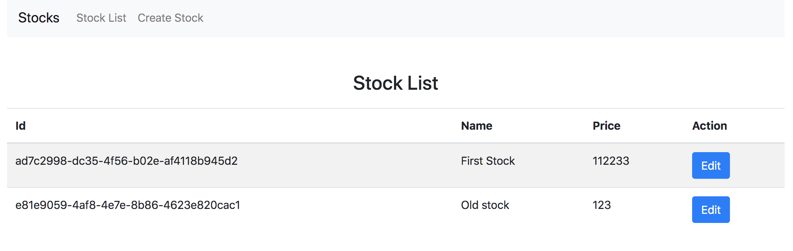

# Stock App

### Description
MVP of Stock application. 
Provides an API and frontend to manage stocks.



### API specification
Frontend - http://localhost/
Swagger UI - http://localhost:8077/swagger-ui.html

- `POST /api/stocks/` Creates a new stock and persists it to storage.
Request:                                                    
```
curl -X POST "http://localhost:8077/api/stocks" -H "accept: */*" -H "Content-Type: application/json" -d "{ \"stockName\": \"new\", \"stockPrice\": 123}"
```  
Response:  
```
 201 CREATED
```                            
- `PUT /api/stocks/{stockId}` Updates a stock with new price and/or name
Request:                                                    
```
curl -X PUT "http://localhost:8077/api/stocks/ad7c2998-dc35-4f56-b02e-af4118b945d2" -H "accept: */*" -H "Content-Type: application/json" -d "{ \"stockName\": \"NEW NAME\", \"stockPrice\": 112233}" 
```  
Response:  
```
200 OK
```  

- `GET /api/stocks` Returns all stocks from repository
Request:                                                    
```
curl -X GET "http://localhost:8077/api/stocks" -H "accept: */*" 
```  
Response:  
```
[
  {
    "id": "ad7c2998-dc35-4f56-b02e-af4118b945d2",
    "stockName": "Payconic",
    "stockPrice": 1122,
    "lastUpdate": "2019-05-18T15:10:49.435014"
  },
  {
    "id": "e81e9059-4af8-4e7e-8b86-4623e820cac1",
    "stockName": "new",
    "stockPrice": 123,
    "lastUpdate": "2019-05-18T15:14:26.761841"
  }
]
```  

- `GET /api/stocks/{stockId}` Returns stock by it's unique id
Request:                                                    
```
curl -X GET "http://localhost:8077/api/stocks/ad7c2998-dc35-4f56-b02e-af4118b945d2" -H "accept: */*" 
```  
Response:  
```
{
  "id": "ad7c2998-dc35-4f56-b02e-af4118b945d2",
  "stockName": "NEW NAME",
  "stockPrice": 112233,
  "lastUpdate": "2019-05-18T15:15:57.218646"
}
```  


###Notes
Initial stocks list is genereted on application startup  

### Technologies
- Spring Boot
- Slf4j
- Springfox/Swagger
- Maven
- Lombok        
- JUnit
- Mockito
- React
- Docker
- Nginx

### Build 

Create an executable Spring Boot jar and build frontend  
`./mvnw clean package`

### Run
#### Docker compose
```
docker-compose up
```

#### Manually
- Run API  
`./target/stocks-0.0.1-SNAPSHOT-exec.jar`

- Run frontend
    ``` 
    cd frontend 
    npm run
    ```


   


 
